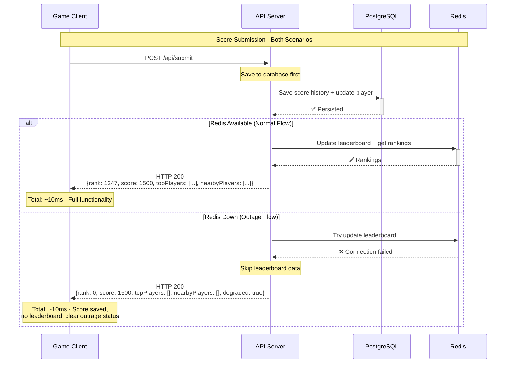
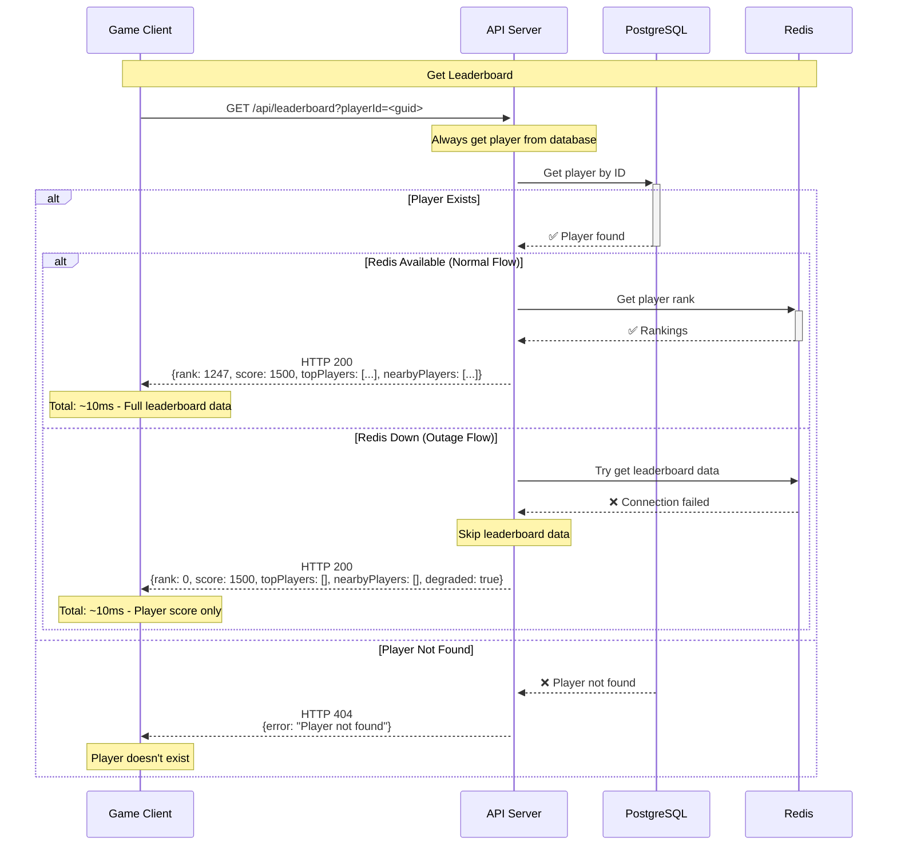

## Context
### Technical context

## Decision records
- [Leaderboard data storage](./adr/ADR-001-Storage.md)
- [Data processing flow](./adr/ADR-002-Data-Processing.md)

## Runtime View

### Submit score

### Get Leaderboard
